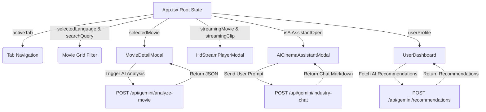

# Technical Documentation - MovieHub (CineBharat)

---

## 1. Executive Technical Summary & Stack

**MovieHub (CineBharat)** is a modern, high-performance web platform designed to analyze, explore, and track the Indian Film Ecosystem across five primary language industries: **Bollywood (Hindi)**, **Tollywood (Telugu)**, **Kollywood (Tamil)**, **Mollywood (Malayalam)**, and **Sandalwood (Kannada)**.

The architecture combines a single-page **React 19** frontend with an **Express 4 Node.js TypeScript server**, integrated directly with **Google Gemini 3.6 Flash AI** (`@google/genai`) and a suite of public external cinema APIs.

### Tech Stack Matrix

| Layer | Technology | Version | Purpose |
| :--- | :--- | :--- | :--- |
| **Frontend Framework** | React | `^19.0.1` | Concurrent rendering, stateful components, SPA UI |
| **Frontend Build System**| Vite | `^6.2.3` | HMR, bundling, ES module compilation |
| **Styling & Design System**| TailwindCSS | `^4.1.14` | Utility-first CSS, dark-theme styling, responsive layouts |
| **Iconography** | Lucide React | `^0.546.0` | Vector icon set for UI widgets & state indicators |
| **Animations** | Motion (Framer Motion)| `^12.23.24` | Smooth transitions, card interactions & modal overlays |
| **Backend Runtime** | Node.js | `^22.x` | Server-side JavaScript execution environment |
| **Server Framework** | Express.js | `^4.21.2` | REST API routing, proxy endpoints & static file hosting |
| **Server Executable** | tsx | `^4.21.0` | Direct execution of TypeScript server files in development |
| **Server Bundler** | esbuild | `^0.25.0` | Ultra-fast production server bundling to CommonJS |
| **AI SDK** | `@google/genai` | `^2.4.0` | Official SDK for Google Gemini 3.6 Flash AI models |
| **Language Compiler** | TypeScript | `~5.8.2` | Static typing, interface definitions & developer safety |

---

## 2. Repository & File Structure

```
MovieHub/
├── docs/
│   ├── README.md                      # Documentation suite entrypoint & overview
│   ├── TECHNICAL_DOCUMENTATION.md     # Technical specification & API contracts
│   └── FUNCTIONAL_DOCUMENTATION.md    # Product features, user personas & UX flows
├── src/
│   ├── components/                    # Component modular sub-system
│   │   ├── AiCinemaAssistantModal.tsx # Chat interface for Gemini 3.6 Flash CineAI
│   │   ├── BoxOfficeAnalyticsDashboard.tsx # Interactive charts & telemetry
│   │   ├── CommunityForum.tsx         # User forum & discussion thread system
│   │   ├── HdStreamPlayerModal.tsx    # HD Video trailer & clip player modal
│   │   ├── HeroBanner.tsx             # Featured flagship movie banner
│   │   ├── LiveApiDataExplorer.tsx    # Live public API querying playground
│   │   ├── MovieCard.tsx              # Grid item component with quick actions
│   │   ├── MovieDetailModal.tsx       # Comprehensive movie detail inspector
│   │   ├── MovieGrid.tsx              # Searchable & filterable movie catalog
│   │   ├── Navbar.tsx                 # Sticky navigation, search & role status
│   │   └── UserDashboard.tsx          # Personal user profile, stats & watchlist
│   ├── data/
│   │   ├── communityData.ts           # Pre-loaded forum threads & comments
│   │   └── indianMovies.ts            # Detailed mock/seed Indian film catalog
│   ├── App.tsx                        # Application state root & routing tabs
│   ├── index.css                      # Tailwind v4 imports & theme customization
│   ├── main.tsx                       # React DOM root entrypoint
│   └── types.ts                       # Domain model interfaces & TypeScript types
├── .env.example                       # Environment variable template
├── index.html                         # Document root HTML template
├── package.json                       # Dependencies & npm scripts definition
├── server.ts                          # Express server, Gemini AI endpoints & API proxies
├── tsconfig.json                      # Compiler options & alias configs
└── vite.config.ts                     # Vite plugins, aliases & HMR setup
```

---

## 3. Data Architecture & Type Definitions (`src/types.ts`)

The application enforces strict typing across all features, including box office financial telemetry, video clips, user roles, community forum threads, and AI response structures.

### Key Types Summary

#### 1. Language & Industry Enums
```typescript
export type LanguageType =
  | "All"
  | "Hindi"
  | "Telugu"
  | "Tamil"
  | "Malayalam"
  | "Kannada"
  | "Pan-India";

export type IndustryType =
  | "Bollywood (Hindi)"
  | "Tollywood (Telugu)"
  | "Kollywood (Tamil)"
  | "Mollywood (Malayalam)"
  | "Sandalwood (Kannada)"
  | "Cross-Industry";

export type BoxOfficeStatusType =
  | "All-Time Blockbuster"
  | "Blockbuster"
  | "Super Hit"
  | "Hit"
  | "Average"
  | "Trending Now"
  | "Upcoming Release";
```

#### 2. User Roles
```typescript
export type UserRole =
  | "Cinephile Fan"
  | "Film Critic"
  | "Aspiring Director"
  | "Actor / Crew Member"
  | "Box Office Analyst";
```

#### 3. Core `Movie` Model Interface
```typescript
export interface Movie {
  id: string;
  title: string;
  originalTitle?: string;
  language: LanguageType;
  industry: IndustryType;
  releaseYear: number;
  releaseDate: string;
  posterUrl: string;
  backdropUrl: string;
  genres: string[];
  rating: number; // Out of 10
  userRatingCount: number;
  synopsis: string;
  duration: string; // e.g., "3h 01m"
  
  // Financial Telemetry (in Crores ₹)
  budgetCrores: number;
  boxOfficeGrossCrores: number;
  indiaNetGrossCrores: number;
  overseasGrossCrores: number;
  roiPercentage: number;
  boxOfficeStatus: BoxOfficeStatusType;
  screenCount: number;
  
  // Cast & Crew
  director: string;
  directorPhotoUrl?: string;
  cast: CastMember[];
  musicDirector: string;
  productionHouse: string;
  cinematographer?: string;
  
  // Video Footage & Trailers
  featuredTrailerUrl: string;
  videoClips: VideoClip[];
  
  // Analytics & Radar Metrics
  reviewSentiment: ReviewSentiment;
  demographicBreakdown: DemographicBreakdown;
  directorStyleRadar: {
    visualGrandeur: number;       // 0 to 100
    storyPacing: number;          // 0 to 100
    emotionalResonance: number;   // 0 to 100
    commercialAppeal: number;     // 0 to 100
    soundtrackIntegration: number;// 0 to 100
  };
  
  // Platform Links & Reviews
  streamingPlatforms: { name: string; logoUrl: string; directUrl: string }[];
  awards: string[];
  tags: string[];
  criticReviews: CriticReview[];
  fanReviews: FanReview[];
  isTrending?: boolean;
  isEditorPick?: boolean;
}
```

#### 4. AI Analysis Response Payload
```typescript
export interface AiMovieAnalysisResponse {
  executiveSummary: string;
  boxOfficeVerdict: string;
  sentimentAnalysis: {
    positivePoints: string[];
    areasOfImprovement: string[];
    overallScore: number;
  };
  targetAudienceDemographics: string;
  directorStyleRadar: {
    visualGrandeur: number;
    storyPacing: number;
    emotionalResonance: number;
    commercialAppeal: number;
    soundtrackIntegration: number;
  };
  industryImpact: string;
}
```

---

## 4. Backend Server Architecture (`server.ts`)

The backend is built with Express.js running on port `3000`. It acts as an API gateway between the React frontend and:
1. **Google Gemini 3.6 Flash AI API**
2. **Public Cinema APIs** (Apple iTunes India, Wikipedia REST, TVMaze, OMDB, TMDB, YouTube oEmbed)

### 4.1 Gemini AI Integration Endpoints

All Gemini endpoints utilize the `@google/genai` SDK and target `gemini-3.6-flash`. If `GEMINI_API_KEY` is not present in `.env`, each endpoint seamlessly returns a structured mock response so the UI operates without errors.

#### `POST /api/gemini/analyze-movie`
- **Purpose**: Generates dynamic executive summaries, sentiment ratings, style radars, and box office verdicts for a film.
- **Request Body**: `{ movieTitle, language, director, budget, boxOffice, plot }`
- **AI Model & Parameters**:
  - Model: `gemini-3.6-flash`
  - MIME Type: `application/json`
- **Output**: JSON payload matching `AiMovieAnalysisResponse`.

#### `POST /api/gemini/recommendations`
- **Purpose**: Produces personalized recommendations based on preferred languages, favorite genres, user persona role, and watch history.
- **Request Body**: `{ preferredLanguages, favoriteGenres, userRole, watchHistory }`
- **Output**: Array of 4 recommended films with match percentages, rationale, and key highlights.

#### `POST /api/gemini/industry-chat`
- **Purpose**: Powers "CineAI", an conversational cinema assistant embedded in the application.
- **System Instruction**: Configured with deep knowledge of Indian cinema history, box office calculations, technical crafts, directors, and actors.
- **Request Body**: `{ userMessage, userRole, conversationHistory }`
- **Output**: Conversational response text string formatted in Markdown.

---

### 4.2 External Public Cinema API Endpoints

The server provides custom proxy endpoints that call public APIs to avoid CORS restrictions on the client side and to aggregate multiple feeds.

| Endpoint | Method | Source External API | Description |
| :--- | :--- | :--- | :--- |
| `/api/cinema/public-search` | `POST` | iTunes + Wiki + TVMaze | Concurrent search across 3 free public services without API keys. |
| `/api/cinema/live-trending` | `GET` | Apple iTunes India | Fetches live featured Indian movie items from iTunes Store India. |
| `/api/cinema/wikipedia-summary` | `GET` | Wikipedia REST API | Fetches summary text, thumbnail image, and page links for a movie title. |
| `/api/cinema/omdb` | `GET` | OMDB API | Fetches full movie metadata using `OMDB_API_KEY` (or fallback public key `trilogy`). |
| `/api/cinema/tmdb` | `GET` | TMDB API v3 | Proxies TMDB search/lookup or returns format specs if unconfigured. |
| `/api/cinema/tvmaze` | `GET` | TVMaze API | Searches Indian web series/shows and fetches cast/episode data. |
| `/api/cinema/youtube` | `GET` | YouTube oEmbed | Resolves YouTube video ID into oEmbed metadata, title, author & embed link. |
| `/api/cinema/multi-api-master` | `POST` | Concurrent Multi-API Aggregator | Performs a single parallel query across iTunes, Wikipedia, TVMaze, OMDB, and TMDB. |

---

## 5. Frontend Architecture & Component Hierarchy

The client is structured as a Single-Page Application (SPA) with tab-based navigation managed inside `src/App.tsx`.

```
[App.tsx State Coordinator]
 ├── [Navbar Component] (Tab selection, language filters, search autocomplete, role display)
 ├── [Main Display Content] (Renders active tab view):
 │    ├── TAB "explore"   ➜ [HeroBanner] + [LiveApiDataExplorer] + [MovieGrid]
 │    ├── TAB "live-api"  ➜ [LiveApiDataExplorer]
 │    ├── TAB "analytics" ➜ [BoxOfficeAnalyticsDashboard]
 │    ├── TAB "streaming" ➜ [HD Streaming Showcase]
 │    ├── TAB "community" ➜ [CommunityForum]
 │    └── TAB "dashboard" ➜ [UserDashboard]
 └── [Global Modals System]:
      ├── [MovieDetailModal] (Deep movie insights, Gemini AI analysis trigger)
      ├── [HdStreamPlayerModal] (HD video trailer / clip player)
      └── [AiCinemaAssistantModal] (CineAI Copilot conversational drawer)
```

### Component Details

| Component Name | File Path | Key Responsibilities |
| :--- | :--- | :--- |
| `Navbar` | [Navbar.tsx](file:///c:/AI-Projects/MovieHub/src/components/Navbar.tsx) | Sticky header, brand logo, tab navigation, live auto-suggest search bar, CineAI copilot launch button, user badge. |
| `HeroBanner` | [HeroBanner.tsx](file:///c:/AI-Projects/MovieHub/src/components/HeroBanner.tsx) | Backdrop image spotlight for featured blockbuster (*Kalki 2898 AD*), key financial highlights, trailer trigger. |
| `MovieGrid` | [MovieGrid.tsx](file:///c:/AI-Projects/MovieHub/src/components/MovieGrid.tsx) | Responsive grid layout rendering `MovieCard`s; filters by language, box office status, genre; sorting by Gross, Rating, ROI. |
| `MovieCard` | [MovieCard.tsx](file:///c:/AI-Projects/MovieHub/src/components/MovieCard.tsx) | Individual card with poster hover effects, rating badge, box office status tag, watchlist toggle button, detail opener. |
| `MovieDetailModal` | [MovieDetailModal.tsx](file:///c:/AI-Projects/MovieHub/src/components/MovieDetailModal.tsx) | Multi-tab modal containing Overview, Financial Breakdown (Gross, Budget, ROI, Screens), Cast & Crew, Radar Style Chart, Demographics, Reviews, Streaming Links & Gemini AI Deep Analysis. |
| `BoxOfficeAnalyticsDashboard` | [BoxOfficeAnalyticsDashboard.tsx](file:///c:/AI-Projects/MovieHub/src/components/BoxOfficeAnalyticsDashboard.tsx) | High-impact telemetry visualizer with ROI leaders, industry revenue contribution, budget vs gross comparative charts, all-time records. |
| `LiveApiDataExplorer` | [LiveApiDataExplorer.tsx](file:///c:/AI-Projects/MovieHub/src/components/LiveApiDataExplorer.tsx) | Live public API sandbox allowing users to run real-time queries against iTunes, Wikipedia, TVMaze, OMDB, TMDB & YouTube APIs. |
| `CommunityForum` | [CommunityForum.tsx](file:///c:/AI-Projects/MovieHub/src/components/CommunityForum.tsx) | Discussion board for cinephiles and critics. Features post creation, upvoting, category filtering (Box Office Battles, Fan Theories, Script Analysis), comments. |
| `UserDashboard` | [UserDashboard.tsx](file:///c:/AI-Projects/MovieHub/src/components/UserDashboard.tsx) | Profile overview showing watched statistics, reputation points, watchlist management, custom list creation, and AI personalized recommendations. |
| `AiCinemaAssistantModal` | [AiCinemaAssistantModal.tsx](file:///c:/AI-Projects/MovieHub/src/components/AiCinemaAssistantModal.tsx) | Floating drawer hosting the "CineAI" assistant powered by Gemini 3.6 Flash. Includes prompt chips, role selector, chat history. |
| `HdStreamPlayerModal` | [HdStreamPlayerModal.tsx](file:///c:/AI-Projects/MovieHub/src/components/HdStreamPlayerModal.tsx) | Modal iframe player for trailers, teasers, lyrical songs, and BTS footage with clip switcher sidebar. |

---

## 6. State Management & Data Flow

Application state is held primarily at the `App.tsx` level and passed down via props, ensuring predictable data flow without external heavy state libraries.



---

## 7. Build, Packaging & Deployment Pipeline

### Scripts Definition (`package.json`)
- `npm run dev`: Runs `tsx server.ts`. Express launches Vite in middleware mode (`SPA` mode) for development.
- `npm run build`: Executes `vite build` (building static client assets to `dist/`), followed by `esbuild server.ts` (bundling Node server code to `dist/server.cjs`).
- `npm run start`: Runs `node dist/server.cjs` for production serving.
- `npm run lint`: Executes `tsc --noEmit` to verify static TypeScript types.

---

## 8. Environment & Configuration Reference

| Environment Variable | Required | Default Value | Description |
| :--- | :--- | :--- | :--- |
| `GEMINI_API_KEY` | Recommended | *(Fallback to Mock)* | API Key for Google Gemini 3.6 Flash models |
| `PORT` | Optional | `3000` | HTTP Server port |
| `APP_URL` | Optional | `"http://localhost:3000"` | Application public base URL |
| `TMDB_API_KEY` | Optional | *(Fallback Mock)* | The Movie Database API Key |
| `OMDB_API_KEY` | Optional | `"trilogy"` | Open Movie Database API Key |
